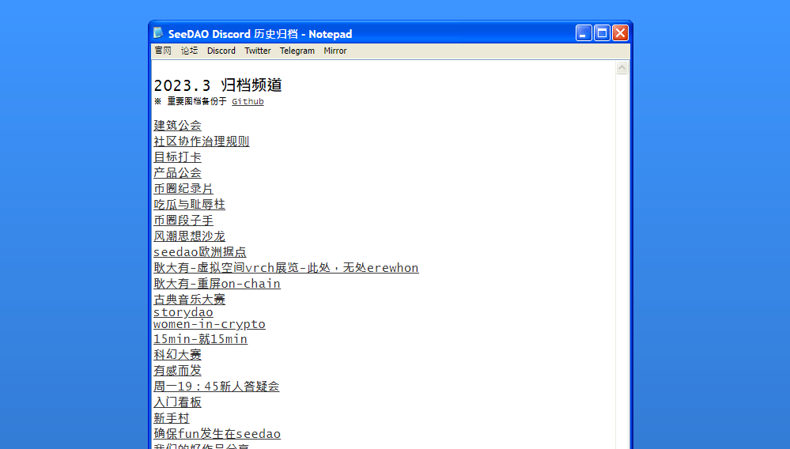

# Discord Backup

Discord 历史频道信息记录归档 (2023.3 以前)

## Getting Started

1. 打开网页 [https://seedao-opensource.github.io/discord-backup/](https://seedao-opensource.github.io/discord-backup/)
2. 选择历史频道，点击浏览历史纪录

## Notes

1. 使用工具 [DiscordChatExporter](https://github.com/Tyrrrz/DiscordChatExporter) 输出 HTML，版本号 2.39.0。
2. 图档的部份主要怕 discord 过期, 一些和 SeeDAO 相关, 大小在 500x500 以上的图备份于 `images/` 中。